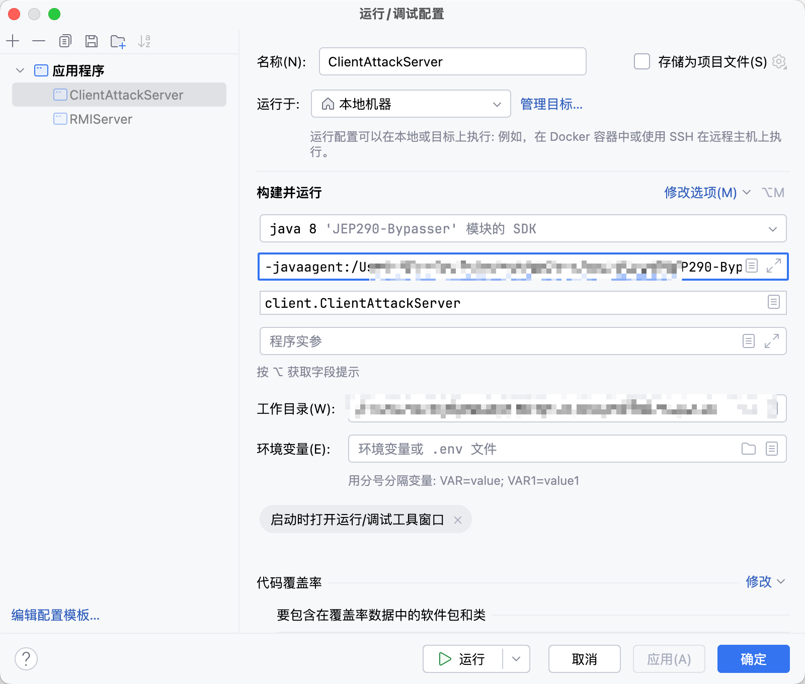

# JEP290-Bypasser

使用 RASP 技术（Java Agent + 字节码插桩）来绕过 JEP-290 的反序列化限制机制。

## 说明

afanti 师傅去 Hook 的是 java.rmi.server.RemoteObjectInvocationHandler 类的 InvokeRemoteMethod 方法的第三个参数，相当于是没有动计算方法 Hash 的地方，而是去将非 Object 的参数改为 Object 的，文章在此：[Bypass JEP290攻击rmi](https://www.anquanke.com/post/id/200860)。而这个项目是去 Hook 了计算方法 Hash 的地方。

## 使用方法

1. 使用 JDK8 去运行 mvn package，在 target 目录下得到 RMIClient-1.0-SNAPSHOT.jar。

2. 运行 RMIServer。

3. IDEA 中编辑 ClientAttackServer 的运行配置：-javaagent:/xxx/xxx/xxx/xxx/xxx/JEP290-Bypasser/target/RMIClient-1.0-SNAPSHOT.jar，如下-->

4. 运行 ClientAttackServer，弹出计算机-->

## 温馨提示

由于编译问题，common 包中的 IRemoteObject 接口写了`public String sayHello(Object object) throws RemoteException;`这行代码，但是 RASP 之后，Client 端实际是调用了 Server 端的`public String sayHello(String name) throws RemoteException;`这行代码。

验证方法：可以在 UnicastRef 类的 invoke(Remote obj, Method method, Object[] params, long opnum) 方法下断点，调试运行 ClientAttackServer，观察 opnum 的值是否已经在网络传输之前就已经被改变。给一张截图，如下-->

